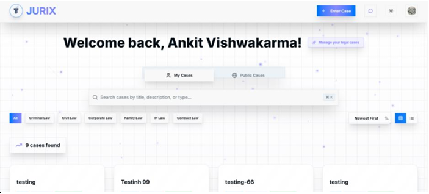
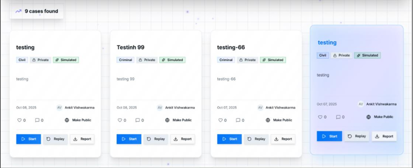
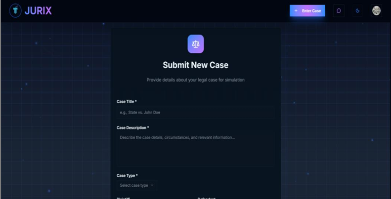
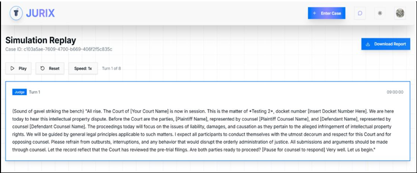

# Jurix: AI Courtroom Simulation

Jurix is an interactive AI-driven courtroom simulation platform designed to mimic real-world legal proceedings. It allows users to upload cases, evidence, and documents, and then simulates courtroom interactions with AI agents representing Prosecutor, Defense, and Judge roles. This tool is ideal for law students, educators, and legal professionals to practice arguments and study courtroom dynamics in a safe and controlled environment.

## Features

### AI Agents for Courtroom Roles:

- **ProsecutorAgent**: Generates prosecutorial arguments using legal datasets.
- **DefenseAgent**: Formulates defense strategies and counter-arguments.
- **JudgeAgent**: Evaluates arguments, maintains courtroom flow, and renders verdicts.

### Evidence Parsing:

- Upload PDFs, DOCX, images, or text documents.
- AI-powered parser converts evidence into structured summaries.
- Users can review, approve, or edit parsed evidence before simulation.

### Legal Knowledge Base:

- Supports IPC, CrPC, Constitution, and other Indian legal frameworks.
- Agents leverage structured datasets for reasoning.

### Simulation Workflow:

- Upload case files and evidence.
- AI parses and summarizes evidence.
- Start courtroom simulation with interactive AI agents.
- Receive detailed case summary including arguments, counterarguments, and verdict.

### Multi-Tier Fallback AI:

- **Primary**: Local custom-trained legal model.
- **Secondary**: Pre-trained open models.
- **Tertiary**: OpenAI / Gemini API integration for enhanced reasoning.

### Frontend & Backend:

- **Frontend**: React + Tailwind CSS
- **Backend**: Flask (Python) with JSON/MongoDB for data storage.

## Installation

Clone the repository:

```bash
git clone https://github.com/your-username/jurix.git
cd jurix
```

Setup Python environment:

```bash
python -m venv venv
source venv/bin/activate   # Linux / macOS
venv\Scripts\activate      # Windows
pip install -r requirements.txt
```

Run the backend:

```bash
cd backend
python app.py
```

Start the frontend:

```bash
cd frontend
npm install
npm run dev
```

Open http://localhost:5173 in your browser.

## Usage

- Upload case evidence via the CaseSubmit page.
- Review and approve parsed evidence in CaseReview.
- Launch simulation to interact with AI agents.
- Observe AI-generated legal arguments and verdicts.
- Optionally export summaries for study or training.

## Screenshots

| Dashboard | Case Cards | New Case Submission | Legal Assistant Chat |
|-----------|------------|--------------------|---------------------|
|  |  |  |  |

---

## Datasets Used

- IPC (Indian Penal Code)
- CrPC (Criminal Procedure Code)
- Constitution of India
- Mock cases and legal dialogues for training

## Contributing

Contributions are welcome!

- Fork the repository
- Create a new branch
- Submit pull requests with improvements or bug fixes
  
---

Built as a solo endeavor, **JURIX** was later carried into the arena of **Avishkar 2025**, alongside **Dhruv Suthar** and **Zoya Khan** where it was presented as a working simulation of AI-assisted judicial reasoning.

> Special credit to:  
> **Dhruv Suthar**  
> **Zoya Khan**

---
## License

MIT License
